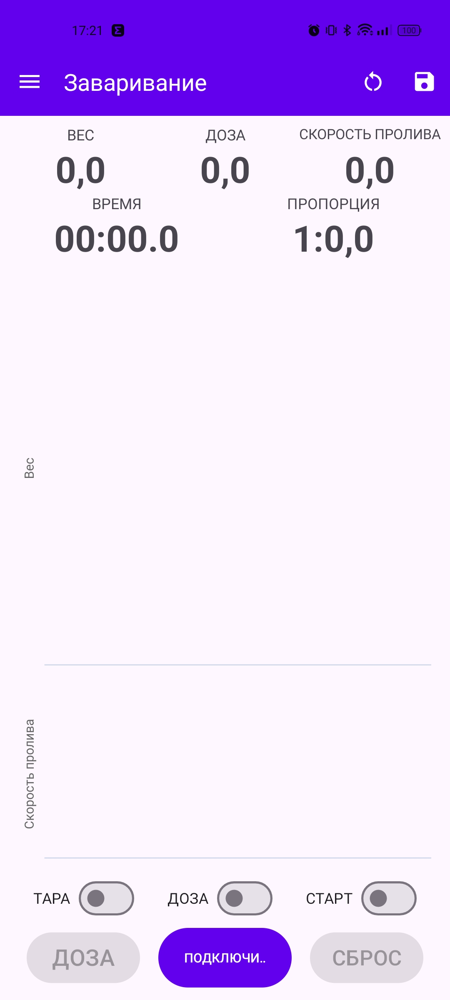
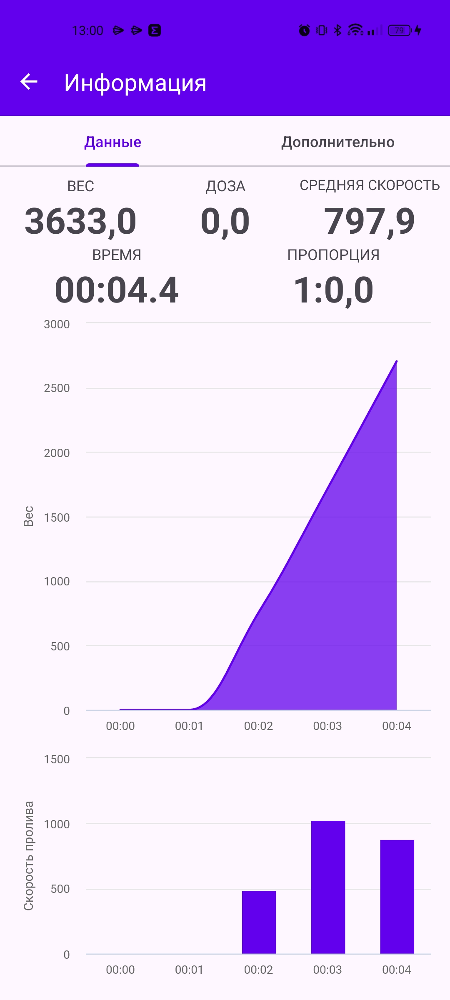
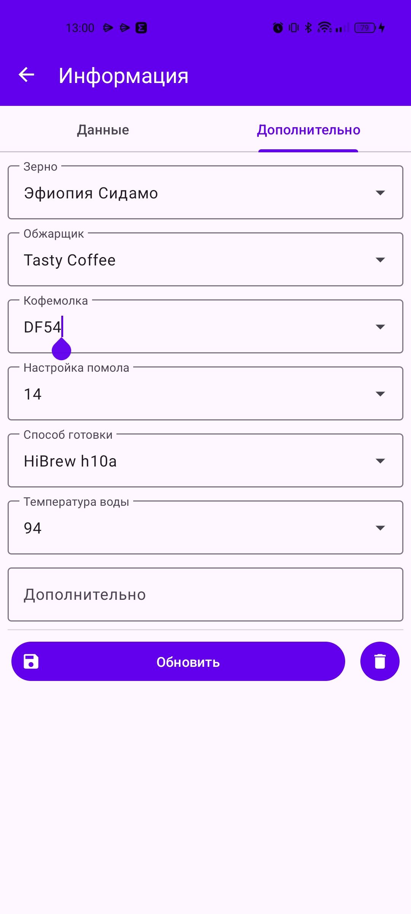
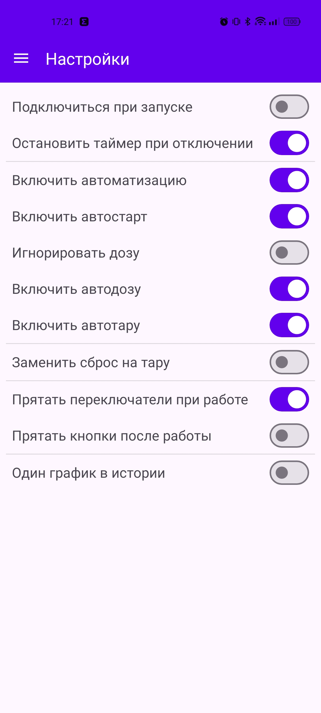

# Futula Coffee Scale
## _Кофейное приложение для Futula Kitchen Scale 3_

  
  
Приложение позволит пользоваться кухонными весами __Futula Kitchen Scale 3__ как кофейными.

## Основные функции

- Показ графика и данных веса;
- Показ графика и данных скорости пролива;
- Показ соотношения кофе к воде;
- Сохранение истории завариваний.

## Дополнительные функции

- Можно зафиксировать вес нажатием на значение веса;
- Можно ввести дозу вручную двойным нажатием на дозу;
- Можно воспользоваться автоматизацией при готовке;
- Можно переключаться между мгновенным и средним значением скорости пролива нажатием на значение;
- Можно добавлять заметки к истории завариваний.

## Справка

### Основной экран

  
  
На этом экране можно увидеть основную информацию о готовке, а именно:
- Вес; (информация с весов)
- Доза; (объём кофе)
- Скорость пролива;
- Время заваривания;
- Пропорция. (соотношение кофе к воде)

Сверху расположены кнопки:
- Открытие меню; (слева)
- Сброс; (сбросить все значения на экране)
- Сохранение значений в историю.

Внизу имеются кнопки:
- Подключиться (к весам) / Старт / Пауза;
- Доза; (записать значение веса как дозу и сбросить вес)
- Сброс. (сбросить все значения на экране)

И переключатели для автоматизации:
- Тара; (автоматически сбрасывает весь при изменении)
- Доза; (автоматически записывает новый вес как дозу)
- Старт. (автоматически запускает таймер при изменении веса)

Переключатели расположены в порядке приоритета, например:
- Если включить все три переключателя, то сначала сработает тара, потом доза, потом старт;
- Если включить тару и старт, то сначала сработает тара, потом старт.

Переключатели можно включать в любомй момент до начала готовки, например если потребуется два или более раза тарировать перед готовкой.
Также в настройках можно отключить частично или полностью любую автоматизацию.

#### Дополнительные функции на основном экране

- Если нажать на Дозу дважды, то можно ввести значение дозы вручную. Работает до и во время готовки;
- Если нажать на Вес, то можно зафиксировать его - при изменении значений на весах значение в приложении не будет меняться;
- Если нажать на Скорость пролива, то можно переключить значение на Среднюю скорость и наоборот.

### История

  
  
Здесь хранится все сохранённые заваривания. Можно посмотреть, нажав на карточку или удалить запись, нажав на значок справа.

### Информация

  

Здесь отображается подробная информация по сохранённому завариванию. Информация поделена на две вкладки:
- Данные;
- Дополнительно.

На вкладке "Данные" отображаются основные параметры. Такжэе можно переключить Среднюю скорость на Скорость пролива и наоборот нажатием на Среднюю скорость.
На вкладке "Дополнительно" можно ввести, сохранить или удалить информации о заваривании. Доступные пункты:
- Зерно;
- Кофемолка;
- Настройка помола;
- Способ готовки;
- Температура воды;
- Дополнительно.

Ранее введённые заметки можно повторно использовать в других записях в истории.

### Настройки

  
  
Здесь можно подстроить поведение приложения под ваши потребности.
- Подключиться при запуске - приложение будет пытаться сразу подключиться к весам при открытии;
- Остановить таймер при отключении - при потере соединения с весами приложение будет останавливать таймер;
- Включить автоматизацию - полностью включить или отключить автоматические функции;
  - Включить автостарт - включить или отключить автоматический старт таймера при изменении веса;
    - Игнорировать дозу - включать автотаймер даже если не введена доза;
  - Включить автодозу - включить автоматическую запись дозы при изменении веса;
  - Включить автотару - включить автоматическое тарирование при изменении веса;
- Заменить сброс на тару - изменить поведение кнопки сброса так, чтобы она работала как кнопка тары;
- Прятать переключатели при работе - при включении таймера будет прятать переключатели автоматизации;
- Прятать кнопки после работы - при завершении заваривания будет прятать нижние кнопки. Увеличивает площадь графиков;
- Один график в истории - будет показывать объединённый график скорости пролива и веса вместо двух графиков при просмотре в истории.

## Ссылки

- [Идея приложения](https://t.me/coffeesaurus) - Кофезавр
- [Реализация на Android](https://t.me/tomatishe) - Томатище
