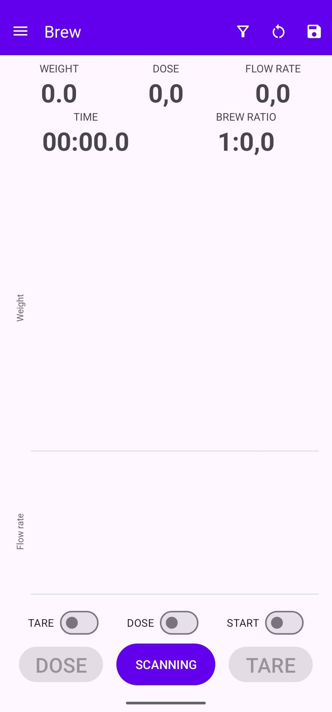
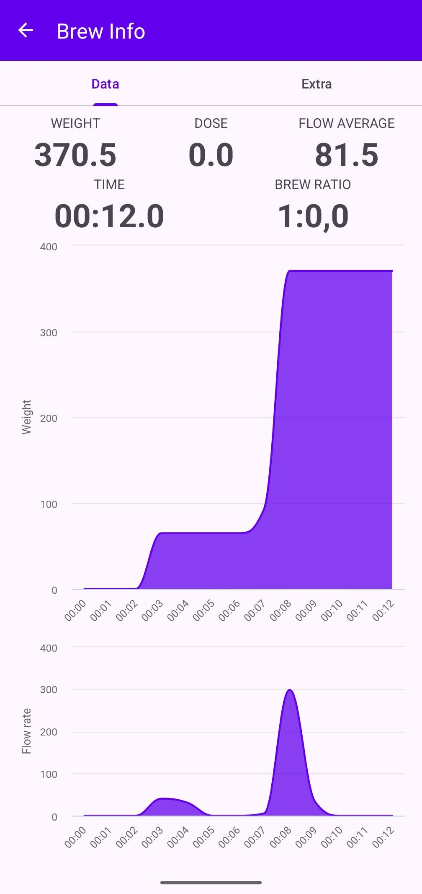
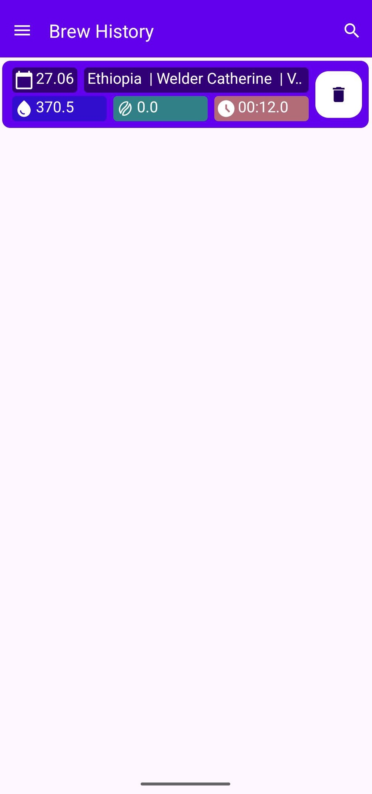
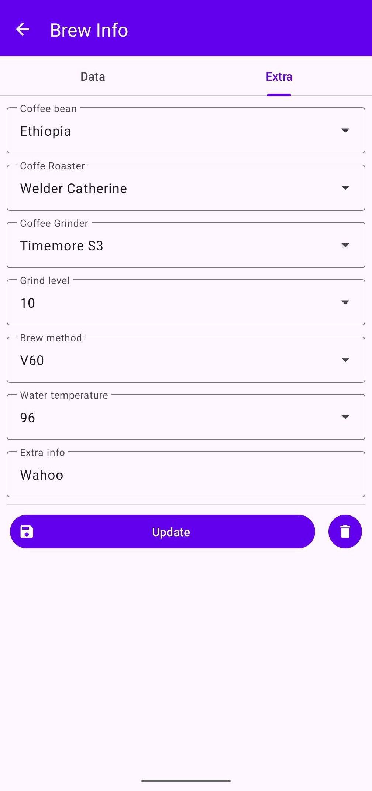
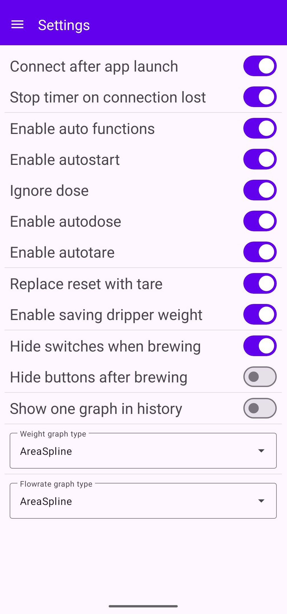

# Futula Coffee Scale
## _Coffee application for Futula Kitchen Scale 3_

## [Русская версия README](README.md)

The application will allow you to use the __Futula Kitchen Scale 3__ as a coffee scale.

## Main functions

- Display of weight graph and data;
- Display of flow rate graph and data;
- Display of coffee to water ratio;
- Saving brewing history.

## Additional functions

- You can fix the weight by clicking on the weight value;
- You can enter the dose manually by double-clicking on the dose;
- You can use automation during brewing;
- You can switch between instantaneous and average flow rate by clicking on the value;
- You can enable calculation of net beverage weight;
- You can add notes to the brewing history.

## Help

### Main screen

On this screen you can see the main information about the preparation, namely:
- Weight; (information from the scale)
- Dose; (coffee volume)
- Flow rate;
- Brewing time;
- Brew ratio. (coffee to water ratio)

At the top there are buttons:
- Open menu; (left)
- Dripper weight; (optional)
- Reset; (reset all values on the screen)
- Save values to history.

At the bottom there are buttons:
- Connect (to the scale) / Start / Pause;
- Dose; (record the weight value as a dose and reset the weight)
- Reset. (reset all values on the screen)

And switches for automation:
- Tare; (automatically resets the weight when it changes)
- Dose; (automatically records the new weight as a dose)
- Start. (automatically starts the timer when the weight changes)

The switches are arranged in order of priority, for example:
- If you turn on all three switches, tare will work first, then dose, then start;
- If you turn on tare and start, tare will work first, then start.

Switches can be turned on at any time before starting preparation, for example, if you need to tare two or more times before preparation.
Also in the settings you can partially or completely disable any automation.

#### Additional functions on the main screen

- If you double-click on Dose, you can enter the dose value manually. Works before and during preparation;
- If you click on Weight, you can fix it - when the values on the scale change, the value in the application will not change;
- If you click on Flow rate, you can switch the value to Average speed and vice versa.

#### Calculation of net beverage weight

To calculate the net weight when preparing a pour over, you need to enable "Enable saving dripper weight" in the settings, after which a funnel icon will appear on the main screen.
If you place the dripper itself on the scale and click on the icon, the dripper weight will be recorded and the icon will change to filled.
After preparing the beverage, you will need to remove the dripper along with the filter and coffee from the scale and click on the filled funnel icon, after which the net beverage weight will be recorded in the weight value and the value will be fixed.

### History

All saved brewings are stored here. You can view it by clicking on the card or delete the record by clicking on the icon on the right.
Also in the upper right corner there is a search by history. Searches for information in blocks:
- Coffee Bean;
- Coffee Roaster;
- Coffee Grinder;
- Brew method;
- Extra info.

### Information

Detailed information on the saved brewing is displayed here. The information is divided into two tabs:
- Data;
- Additionally.

The "Data" tab displays the main parameters. You can also switch Average speed to Flow rate and vice versa by clicking on Average speed.
On the "Additionally" tab, you can enter, save or delete information about the brewing. Available items:
- Coffee Bean;
- Coffee Roaster;
- Coffee Grinder;
- Brew method;
- Water temperature;
- Extra info.

Previously entered notes can be reused in other entries in the history.

### Settings

Here you can adjust the application behavior to your needs.
- Connect after app launch - the application will try to connect to the scale immediately when opened;
- Stop timer on connection lost - if the connection with the scale is lost, the application will stop the timer;
- Enable auto function - completely enable or disable automatic functions;
    - Enable autostart - enable or disable automatic timer start when the weight changes;
        - Ignore dose - enable autotimer even if the dose is not entered;
    - Enable autodose - enable automatic dose recording when the weight changes;
    - Enable autotare - enable automatic taring when the weight changes;
- Replace reset with tare - change the behavior of the reset button so that it works like a tare button;
- Enable saving dripper weight - add a button to save the funnel weight to calculate the net beverage weight;
- Hide switches when brewing - when the timer is turned on, it will hide the automation switches;
- Hide buttons after brewing - after finishing brewing, it will hide the bottom buttons. Increases the area of the graphs;
- One graph in history - will show a combined graph of flow rate and weight instead of two graphs when viewing in history;
- Weight graph type - changes the appearance of the weight graph;
- Flow graph type - changes the appearance of the flow graph.

Appearance types:
- Area - filled graph with sharp lines between points
- AreaSpline - filled graph with smooth lines between points
- Column - column graph
- Line - line between points with a sharp transition
- Spline - line between points with a smooth transition

## TODO

✅ Manual dose editing  
✅ Net weight calculation  
✅ "Grinder" field  
✅ Detailed cards  
✅ Search by history  
✅ Graph appearance customization  
🔲 Automatic stop  
🔲 Setting the display of graphs during pouring (one for all, one of two, both, more/less)  
🔲 Point ratings  
🔲 Filter by brewing date  
🔲 Filter by fields  
🔲 Export to JSON  
🔲 Export to CSV  
🔲 Start/Stop timer without conditions  

## Application update

Update checking is not built into the application, but you can add update checking via [Obtainium](https://github.com/ImranR98/Obtainium).
When adding an application, it is enough to specify a link to the repository https://github.com/wdrs/FutulaCoffeeScale

## Links

- [Application idea](https://t.me/coffeesaurus) - Coffeesaurus
- [Android implementation](https://t.me/tomatishe) - Tomatishe